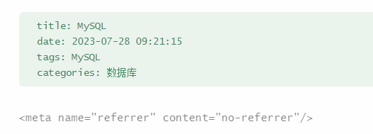

> 每次部署的步骤，可按以下三步来进行

```sh
npx hexo clean
npx hexo generate
npx hexo deploy
```

> 一些常用命令：

```sh
npx hexo new "postName" #新建文章
npx hexo new page "pageName" #新建页面
npx hexo generate #生成静态页面至public目录
npx hexo server #开启预览访问端口（默认端口4000，'ctrl + c'关闭server）
npx hexo deploy #将.deploy目录部署到GitHub
npx hexo help  # 查看帮助
npx hexo version  #查看Hexo的版本
```

> 网络图片不显示在标题下面添加以下内容

```html
<meta name="referrer" content="no-referrer"/>
```


