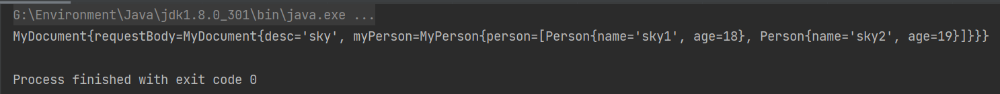
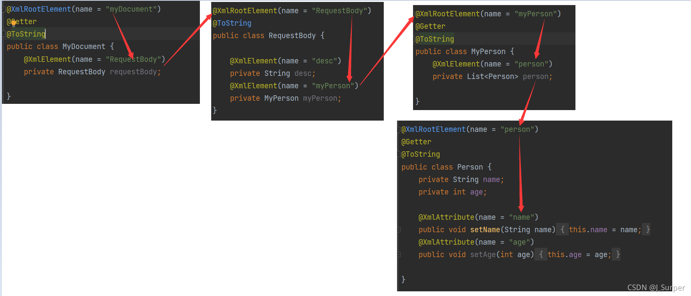

> 需要的xml文件

```xml
<?xml version="1.0" encoding="utf-8"?>
<myDocument>
    <desc>sky</desc>
    <myPerson>
        <person name="sky1" age="18"/>
        <person name="sky2" age="19"/>
    </myPerson>
</myDocument>
```

> 基本步骤

1. 定义好各个xml元素对应的javabean，在类上加注解@XmlRootElement(name = “xxx”)
2. 在各个子元素对应的java字段上（如desc、myPerson）加注解 @XmlElement(name = “xxx”)
3. 其中person的xml标签比较特殊，具有name和age这2个属性，需要做特殊处理：不能直接在name字段上加注解，而是需要先建立set或者get方法，在方法上加注解@XmlAttribute(name = “xxx”)

```java
@XmlRootElement(name = "myDocument")
public class MyDocument{
    @XmlElement(name = "desc")
    private String desc;
    @XmlElement(name = "myPerson")
    private MyPerson myPerson;
}
```

```java
@XmlRootElement(name = "person")
public class Person{
    private String name;
    private int age;
    @XmlAttribute(name = "name")
    public void setName(String name) {
        this.name = name;
    }
    @XmlAttribute(name = "age")
    public void setAge(int age) {
        this.age = age;
    }
}
```

```java
@XmlRootElement(name = "myPerson")
class MyPerson{
    @XmlElement(name = "person")
    private List<Person> person;
}
```

测试：

```java
public class TestXml {

    public static void main(String[] args) throws Exception{

        String xml = "<?xml version=\"1.0\" encoding=\"utf-8\"?>\n" +
                "<myDocument>\n" +
                "    <desc>sky</desc>\n" +
                "    <myPerson>\n" +
                "        <person name=\"sky1\" age=\"18\"/>\n" +
                "        <person name=\"sky2\" age=\"19\"/>\n" +
                "    </myPerson>\n" +
                "</myDocument>";

        JAXBContext context = JAXBContext.newInstance(MyDocument.class);
        Unmarshaller unmarshaller = context.createUnmarshaller();
        StringReader sr = new StringReader(xml);
        MyDocument myDocument = (MyDocument) unmarshaller.unmarshal(sr);
        System.out.println(myDocument);
    }
}
```


图解：

